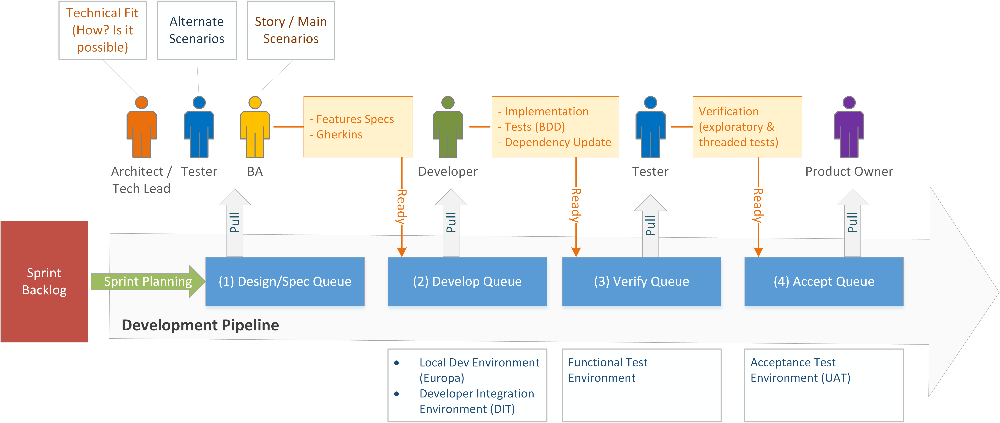
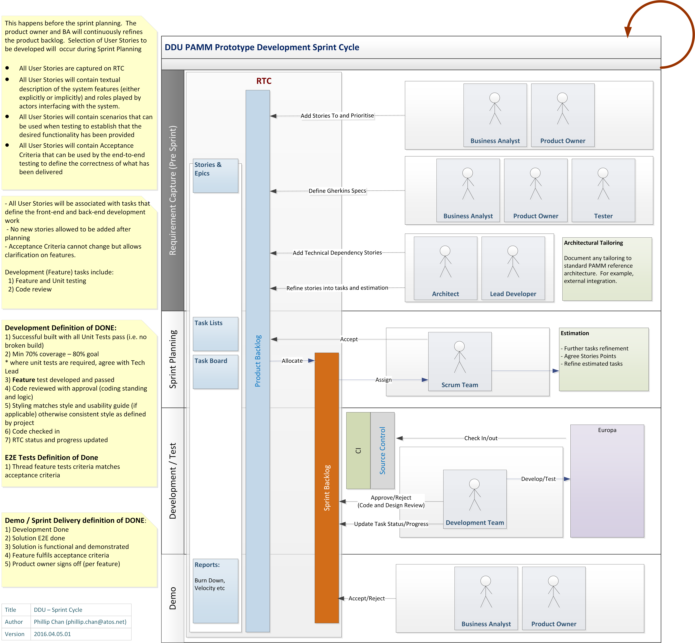
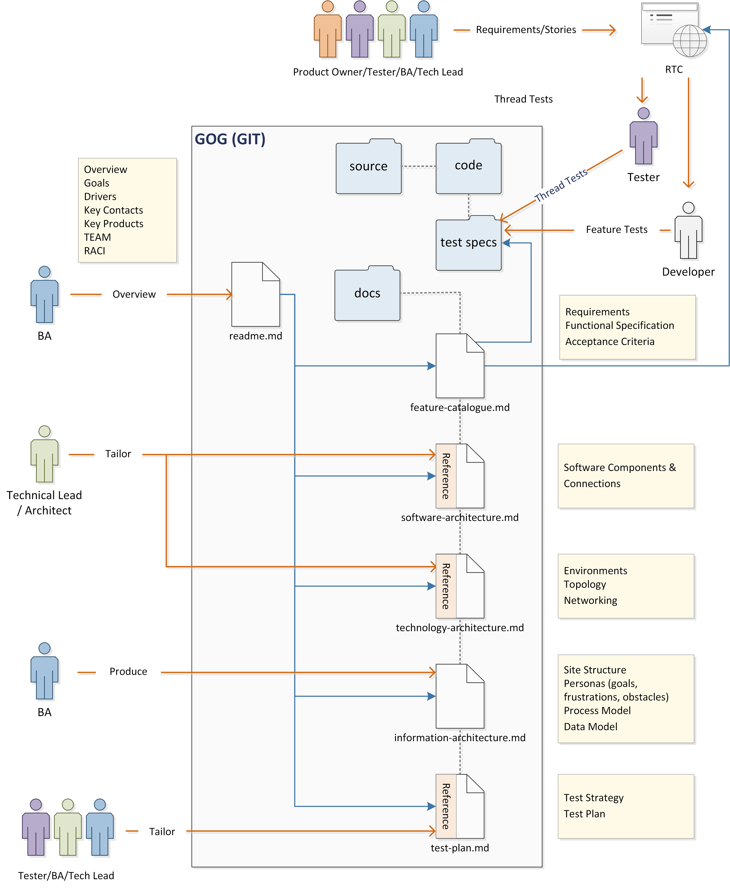

## Appendix - EPI/DPU Development Process
[Back to Read Me](../readme.md)

- [Sprint Planning](#sprint-planning)
- [Definition of Done](#definition-of-done)
- [Development Pipeline](#development-pipeline)
- [Sprint Cycle](#sprint-cycle)
- [Documentation Work Flow](#documentation-work-flow)

### Sprint Planning

The product owner and the BA will continuously refine the 
product backlog. Selection of User Stories to be developed 
will occur during Sprint Planning. 

- All User Stories are to be captured on Work Item Tracking.
- All User Stories will contain description of the system 
features and the roles played by actors interfacing with the 
system.
- All User Stories will contain scenarios that can be used
to test the desired functionality has been provided.
- All User Stories will contain Acceptance Criteria that can
be used by end-to-end testing.

[User Stories]() ( -- apply link to project User Stories)

### Definition of Done

*Definition of Done is used as a checklist to verify if all necessary value-
added activities were completed.  Definition of Done can apply at 3 different levels: for a feature, a sprint or a release.*

*(Insert Project Definition of Done here or provide a link)*

### Development Pipeline

### Sprint Cycle

  
### Documentation Work Flow

