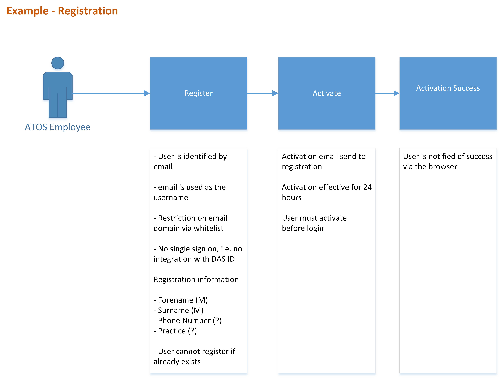
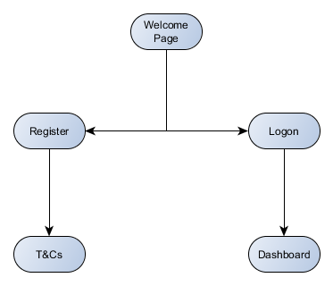
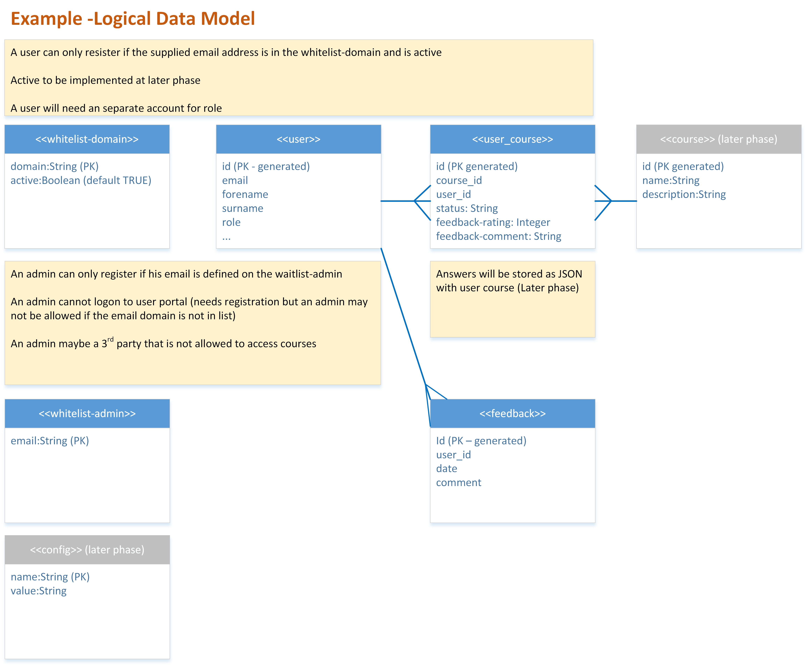

## *[Project Reference here]* - Information Architecture
[Back to Read Me](../readme.md)

- [User Journeys](#user-journeys)
- [Features Catalogue <b>*provide link to RTC or Trello*</b>](#)
- [Site Navigation](#site-navigation)
- [Data Model](#data-model)

###User Journeys
*Describe the sequence of tasks performed by the personas. This should include workflow diagrams that illustrate the process flow and a link to the personas documentation*

###Site Navigation

*Describe the structure of site pages and the associated navigation and partnerships between the pages. This should include the navigation diagrams*

###Data Model
*Describe the data entities, their attribute*
