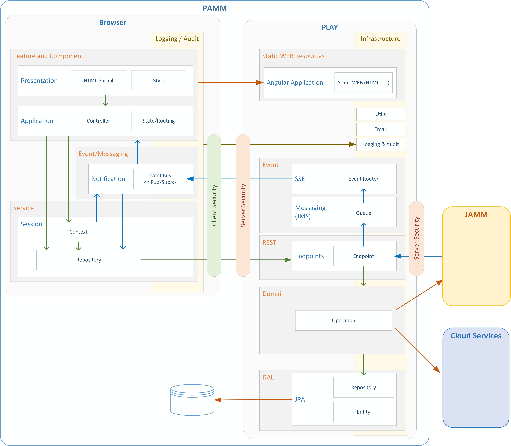

## *[Project Reference here]* - Software Architecture
[Back to Read Me](../readme.md)

*For most DPU projects the following text will suffice.  If you need to tailor the software architecture, the visio diagram is provided in the design folder*

This project will utilise the standard PAMM architecture as defined in https://github.com/gatblau/pamm.seed.  The diagram below shows the tailored version with the following:

- Removed SSE and messaging – No push requirement
- Removed JAMM integration
- Specified Box integration
- Specified MySql DB
  

