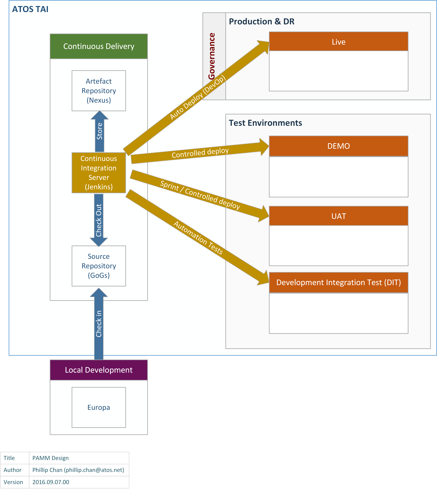
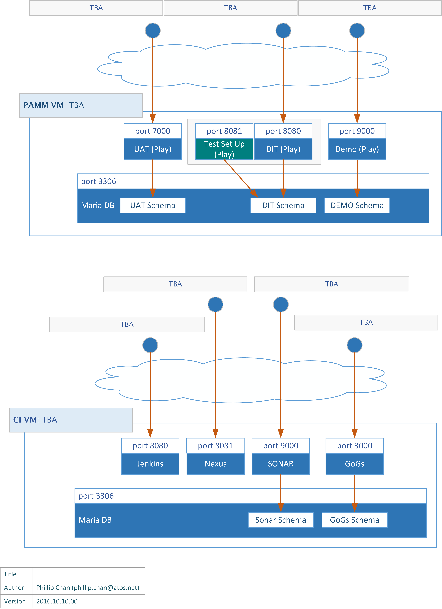

## *[Project Reference here]* - Technology Architecture
[Back to Read Me](../readme.md)

- [Environment](#environment)
- [Topology](#topology)

*The follow shows the deployment to TAI which is the standard for DPU projects.*
###Environment
[Project Name here] will utilize the standard DDU PAMM environment design as shown below:

  
###Topology
The project will utilise PAMM Basic Bundle (see PAMM Deployment Blueprints) which is the minimal configuration possible.  The following diagram shows the deployment topology.

