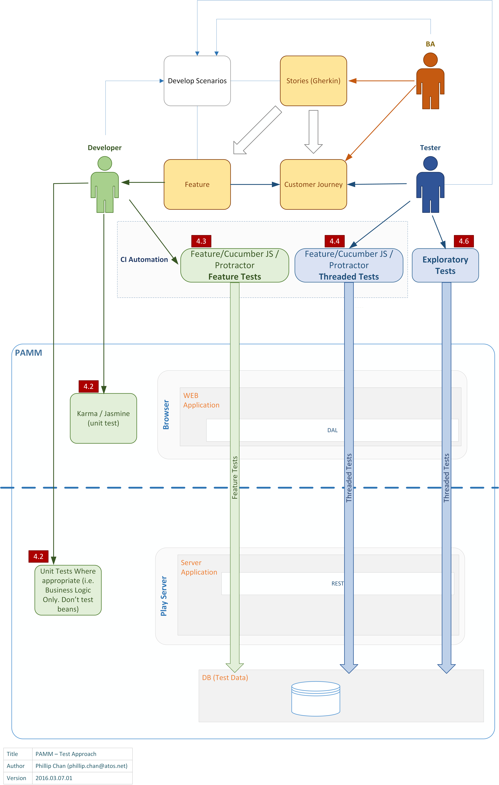
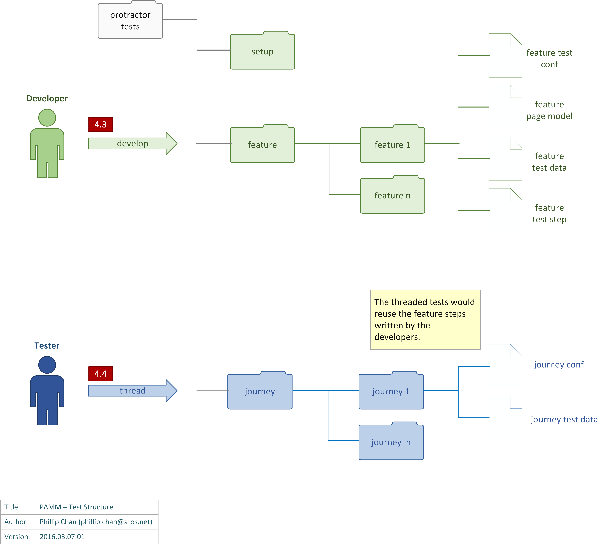

## *[Project Reference here]* - Test Plan
[Back to Read Me](../readme.md)

- [Test Strategy](#test-strategy)
- [Logical View](#logical-view)
- [Packaging](#packaging)

*Describe the Testing Strategy for the project which should be in line with the Atos "Agile Test Strategy" documentation.  Explain which methodologies will be employed and which test levels are applicable for the project.*

###Feature Catalogue
Requirements and progress are managed by *[tool]* and be accessed by the following link.  Feature catalogue implementation can be found at the following locations *[links to RTC or Trello]*

###Test Strategy
The following details the test strategy for [Project Name here] adopted from document "Agile Test Strategy V1d Draft" in particular Section 4 - Testing Levels.

This project will utilise Scrum as its Agile methodology and not Scrumban as specified in Section 3 of the document.  However, a developer will commit to a story rather individual tasks.  This is similar to Scrumban's approach.

####The following lists the test levels that are applicable for the Mod-055 project###
- 4.2 Unit/Component Testing (developers)
- 4.3 Feature Testing (developers)
- 4.4 System / Threading Testing (Test Specialist)
- 4.6 Exploratory Testing (Tester)

####The following sections do not apply to this prototype:###
- 4.5 Non Functional
- 4.7 System Integration
- 4.8 OAT
- 4.9 UAT

###Logical View
The diagram illustrate the logical view.  The numbered red boxes refer to the corresponding section of the strategy document.  In summary:

-	BA, Tester and Developers will be responsible for developing the stories in “Gherkins” 
-	BA/Tester will devise the user journey (threaded tests – UI straw man)
-	Developers will developer the feature tests from the Gherkins (-> Cucumber JS) – this will be used as the acceptance criteria?
-	4.2, 4.3, 4.4 will be included as part of CI
-	4.6 is always manual by default

###Packaging
-	Developers will be responsible for writing feature tests
-	All test data will be externalized (i.e. not hard coded).  This allows the tests to be reused for threading.
-	Testers will implement individual journeys by threading the feature tests and provide the appropriate test data

